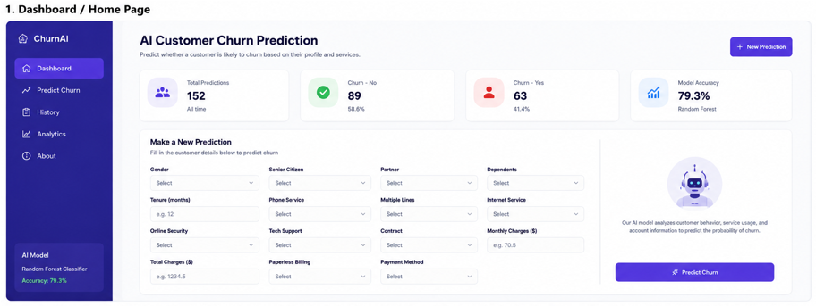
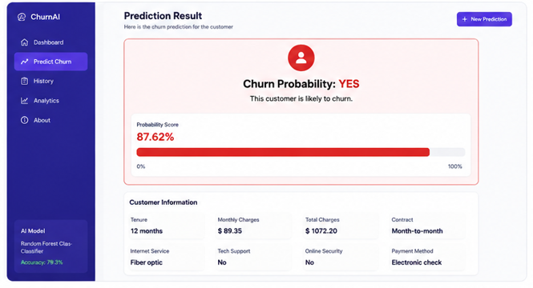

# 🚀 AI Customer Churn Prediction Platform

A full-stack AI-powered customer churn prediction system built using React, Tailwind CSS, FastAPI, and Machine Learning.

---

# 🌍 Live Demo

Frontend: https://customer-churn-ai.vercel.app

Backend API: https://customer-churn-ai-vwlf.onrender.com

---

# 📌 Project Overview

This project predicts whether a customer is likely to leave a company (customer churn) based on customer behavior, billing information, and service usage.

The system uses a trained Machine Learning model integrated with a modern React frontend and FastAPI backend.

---

# ✨ Features

✅ AI-powered churn prediction  
✅ Modern React dashboard UI  
✅ FastAPI backend API  
✅ Machine Learning integration  
✅ Real-time prediction results  
✅ Probability score visualization  
✅ Premium SaaS-style interface  

---

# 🛠️ Tech Stack

## Frontend
- React.js
- Tailwind CSS
- Axios

## Backendapp
- FastAPI
- Python
- Uvicorn

## Machine Learning
- Scikit-learn
- Pandas
- NumPy

---

# 📊 Machine Learning Model

The model was trained on telecom customer data to predict customer churn using features like:

- Monthly charges
- Total charges
- Contract type
- Internet service
- Tech support
- Online security

### Model Used
- Random Forest Classifier

### Accuracy
- ~79% Accuracy

---

# 📷 Project Screenshots

## Dashboard UI


---

## Prediction Result


---

# 🚀 Installation

## Backend Setup

```bash
cd backend
pip install -r requirements.txt
uvicorn main:app --reload

# 📷 Project Screenshots

## Dashboard UI



---

## Prediction Result



---


)
